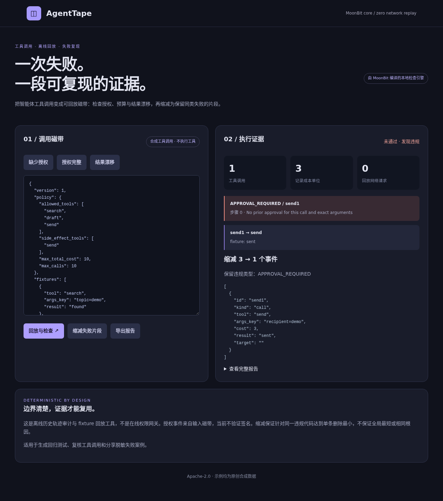

# AgentTape

**Replay with evidence.** A MoonBit-native toolkit for deterministic tool-call replay, policy checks, and failure reduction.

把工具调用失败保存成可复现的证据。AgentTape 使用一个 MoonBit 内核，在命令行和浏览器中检查调用轨迹、离线回放预置响应，并把失败轨迹缩减为保留同类违规的片段。

[2026 MoonBit 9 月黑客松](https://moonbitlang.github.io/Hackathon2026/) · Apache-2.0

## 参赛材料

| 材料 | 链接 |
| --- | --- |
| 项目申报书 | [一页 Markdown 正文](submission/project-application.md) |
| 一页项目说明 | [PDF](submission/project-summary.pdf) · [正文](submission/project-summary.md) |
| 技术与验收说明 | [PDF](submission/technical-report.pdf) · [正文](submission/technical-report.md) |
| 路演演示文稿 | [PDF](submission/pitch-deck.pdf) · [PPTX](submission/pitch-deck.pptx) |
| 实际操作视频 | [观看或下载 MP4，1 分 52 秒，中文配音与字幕](https://github.com/CodeAIKai/agent-tape/raw/refs/heads/main/submission/demo.mp4) |
| 自动化验证 | [核心与宿主测试](evidence/test_results.txt) · [浏览器检查](evidence/browser_checks.json) |

[](https://github.com/CodeAIKai/agent-tape/raw/refs/heads/main/submission/demo.mp4)

## 一分钟运行

需要 Git 和 Node.js 20 或更新版本。仓库已附带 MoonBit 编译产物，无需安装 npm 依赖、配置密钥或训练模型。

```bash
git clone https://github.com/CodeAIKai/agent-tape.git
cd agent-tape
npm test
node scripts/replay.mjs fixtures/approved.json
node scripts/replay.mjs fixtures/missing-approval.json --minimize
```

第一份磁带检查通过。第二条命令把缺少授权的轨迹从 3 个事件缩减到 1 个，保留 `APPROVAL_REQUIRED`。

浏览器演示另需 Python 3：

```bash
python3 -m http.server 8013 --bind 127.0.0.1 --directory web
```

打开 **http://127.0.0.1:8013**，依次点击“缺少授权”“缩减失败片段”“授权完整”和“结果漂移”，即可复现视频中的流程。“导出报告”下载当前检查或缩减结果。“导入磁带文件”支持本地 JSON 文件，文件内容只在当前浏览器读取。编辑输入后，旧报告会失效，避免导出与输入不一致的结果。

## 核心能力

- **规则检查：** 工具白名单、累计记录成本、调用次数，以及与调用 ID、工具和参数绑定的事前授权。
- **离线回放：** 按工具名与参数键精确匹配 fixture；发现缺失响应或结果漂移时给出错误。内核不访问网络，也不执行真实工具。
- **失败缩减：** 反复删除单条事件并复验，输出保持首个违规代码的 1-minimal 子序列。
- **共享实现：** Node CLI 与浏览器调用同一个 MoonBit 编译内核，规则只实现一次。

| 示例 | 预期结果 |
| --- | --- |
| `fixtures/approved.json` | 授权有效，检查通过 |
| `fixtures/missing-approval.json` | `APPROVAL_REQUIRED`；可缩减为 1 个事件 |
| `fixtures/drift.json` | `RESULT_DRIFT`，记录结果与 fixture 不一致 |

CLI 检查通过或成功完成缩减时退出码为 `0`；检查发现违规或内核拒绝输入时为 `1`；缺少文件参数或文件读取失败时为 `2`。例如 `node scripts/replay.mjs fixtures/drift.json` 的预期退出码是 `1`，可用于回归检查。

读取标准输入、保存报告：

```bash
node scripts/replay.mjs - --minimize < fixtures/missing-approval.json
node scripts/replay.mjs fixtures/approved.json --output report.json
```

`--output` 只创建新文件，防止覆盖磁带或已有报告；参数错误返回退出码 `2`。`--help` 显示命令格式。

指定缩减目标，保留同一条调用上的违规：

```bash
node scripts/replay.mjs fixtures/missing-approval.json --minimize --violation APPROVAL_REQUIRED --event send1
```

浏览器也可从“缩减目标”选择违规与调用。结果包含目标调用标识、删除的事件标识和复验报告；保留调用标识仍不等同于保留全部因果上下文。

## 从 MoonBit 源码构建

按 [MoonBit 官方文档](https://docs.moonbitlang.com/en/latest/)安装工具链，然后运行：

```bash
bash scripts/build.sh
node scripts/benchmark.mjs
```

构建脚本依次运行格式化、12 项核心测试、JS 后端编译和宿主集成测试，并更新网页使用的内核与示例。验证环境：`moon 0.1.20260920 (914d7da)`、`moonc v0.10.14+7d59c7ec9`、Node.js 20；[工具链记录](evidence/toolchain.txt)。

性能脚本对同一合成磁带重复回放 1,000 次，输出本机耗时与缩减结果；它是单机微基准，不能据此推断相对其他框架的性能。

## MoonBit 包接入

`src/core` 是独立于浏览器和 Node 的 MoonBit 包，公开 `evaluate_json`、`minimize_json` 和 `minimize_target_json` 三个字符串接口。`src/main.mbt` 仅保留 JS 导出绑定。仓库中的原生调用示例可以直接运行：

```bash
moon run src/example --target js
```

示例通过 `CodeAIKai/agent_tape/core` 导入内核并检查一份授权完整的磁带。该模块尚未发布到 Mooncakes；源代码与本地导入示例均随仓库提供。

## 批量回归检查

`npm run check` 一次核对三份示例的预期结果，包含应当发现违规的负向用例。自定义清单使用 `fixtures/regression-suite.json` 的格式：每项指定相对文件名、预期通过状态和违规代码集合。

运行 `node scripts/check-suite.mjs fixtures/regression-suite.json`，全部符合预期返回 `0`，行为回归返回 `1`，清单或文件读取错误返回 `2`。清单只能读取其所在目录内的磁带，越界路径和指向目录外的符号链接会被拒绝。

## 代码导航

| 路径 | 内容 |
| --- | --- |
| `src/core/tape.mbt` | 可导入的 MoonBit 核心包：校验、规则、回放、缩减 |
| `src/core/tape_wbtest.mbt` | MoonBit 核心行为测试 |
| `web/agent_tape.js` | 从 MoonBit 生成的 ES module |
| `web/app.js`、`web/index.html` | 浏览器交互与展示 |
| `scripts/replay.mjs`、`tests/host.mjs` | 命令行入口与宿主集成测试 |
| `fixtures/` | 三份可直接运行的合成磁带 |
| `submission/` | 项目说明、技术说明、路演文件和配音视频 |

## 磁带格式

[JSON Schema](schema/tape.schema.json) 可用于编辑器补全与结构校验；[格式说明](docs/tape-format.md) 列出字段、上限和运行时校验边界。跨事件授权、重复标识、预算等语义仍由 MoonBit 内核判断。

## 适用范围

输入协议版本为 `1`，上限为 300 个事件、300 个 fixture 和 200,000 字符；缩减最多接受 60 个事件。记录成本使用非负整数，参数键使用精确字符串匹配，由调用方负责规范化。

AgentTape 检查历史轨迹，不验证授权签名、不强制线上权限、不自动脱敏，也不执行完整智能体。缩减结果保证无法继续单条删除而保留目标违规代码，不保证全局最短或相同根因。示例均为合成数据。

## 可选报告解读

`scripts/explain.py` 可通过 DeepSeek API 解释已有报告；该功能独立于回放、缩减和网页演示，不改变 MoonBit 的判定。安装 `requirements-api.txt` 并在服务端环境中配置 `DEEPSEEK_API_KEY` 后，可运行 `python3 scripts/explain.py report.json`。输入应先脱敏；密钥不进入网页或仓库。

## 许可与来源

原创实现采用 [Apache-2.0](LICENSE)。[参考资料](docs/参考资料.md)、[开发与材料来源](PROVENANCE.md)及[第三方说明](THIRD_PARTY.md)记录实现依据与工具使用。编译产物包含的 MoonBit core 代码，其完整许可证和 NOTICE 保存在 `third_party/`。

## 可重复的性质检查

`npm test` 包含固定种子的 64 组生成磁带、832 次断言，验证 fixture 重排和无关响应不改变回放结果、预算收紧与放宽、删除授权后的定位，以及指定事件缩减的子序列、固定点和单条删除最小性。这些检查用于发现跨输入组合的回归，不构成对任意输入的形式化证明。

## 浏览器交互验证

安装 `requirements-browser.txt` 和 Playwright Chromium 后，运行 `python3 tests/browser.py`，验证本地导入、报告下载、无效输入、文件上限和移动布局。
